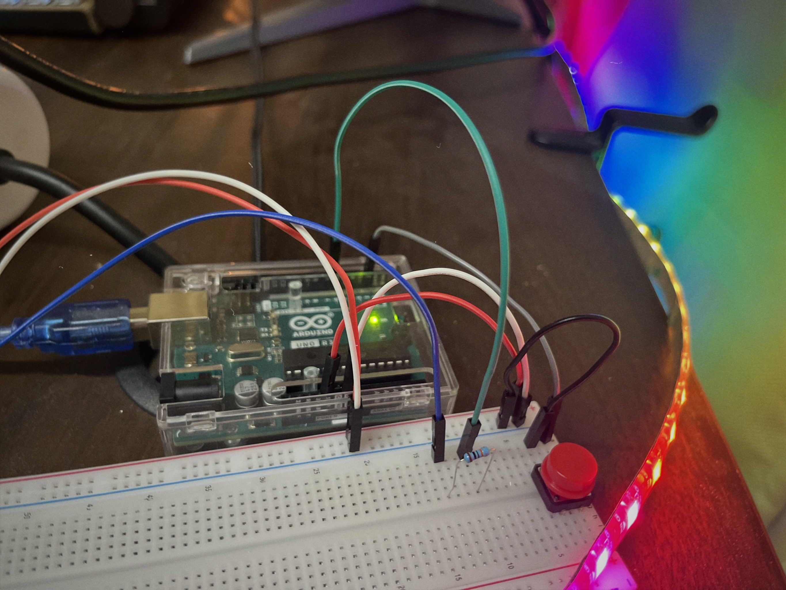
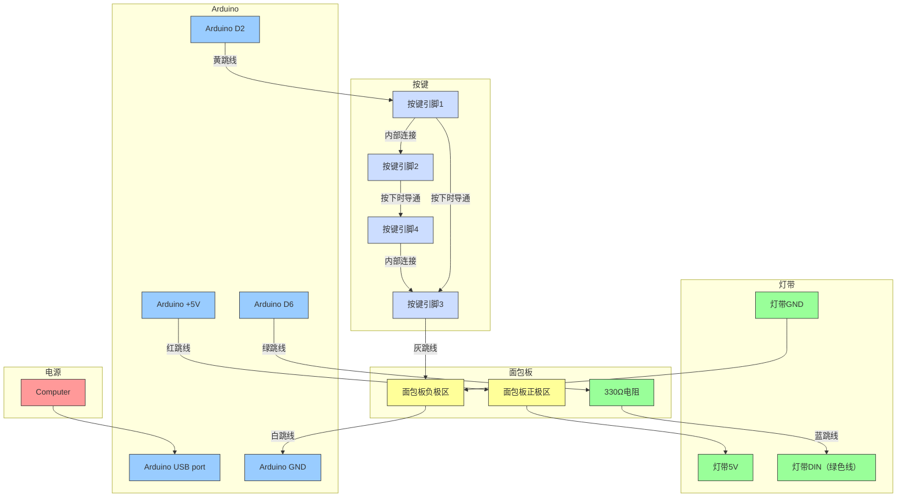

# Arduino RGB灯带系统



## 项目概述
An Arduino-based RGB lighting system, featuring 5 lighting modes.

## 🌟 Features

### 🎛️ 控制方式
- **按键控制**：
  - 短按：循环切换灯光模式
  - 长按(>1秒)：开关灯

## 硬件清单

### 必需组件
| 组件                | 数量 | 参考价格 |
| ------------------- | ---- | -------- |
| Arduino Uno R3      | 1    | ¥161     |
| WS2812B灯带60灯 5V  | 1    | ¥27      |
| 轻触开关 12×12 四脚 | 1    | ¥0.5     |
| 330Ω电阻            | 1    | ¥0.1     |

**总成本**：约¥200

## 接线图



## 安装指南

### 1. 硬件组装
1. 将灯带VCC/GND连接到面包板正/负极区
2. 灯带DIN通过330Ω电阻接Arduino D6
3. 轻触开关对角脚分别接GND和D2

### 2. 软件 Setup

```bash
# Clone repository
git clone https://github.com/chenxing-dev/arduino-rgb-light.git

# Open in Arduino IDE
1. 安装库：FastLED
2. 选择开发板 (Arduino Uno)
3. 上传程序`rgb_desk_light.ino`
```

### 基本操作
1. **短按按键**：循环切换灯光模式
2. **长按按键(>1秒)**：开关灯

## 故障排除

| 问题       | 解决方案               |
| ---------- | ---------------------- |
| 按键无响应 | 确认开关对角脚接线正确 |

## 贡献指南
欢迎提交Pull Request！

## 许可证
[MIT License](LICENSE)
