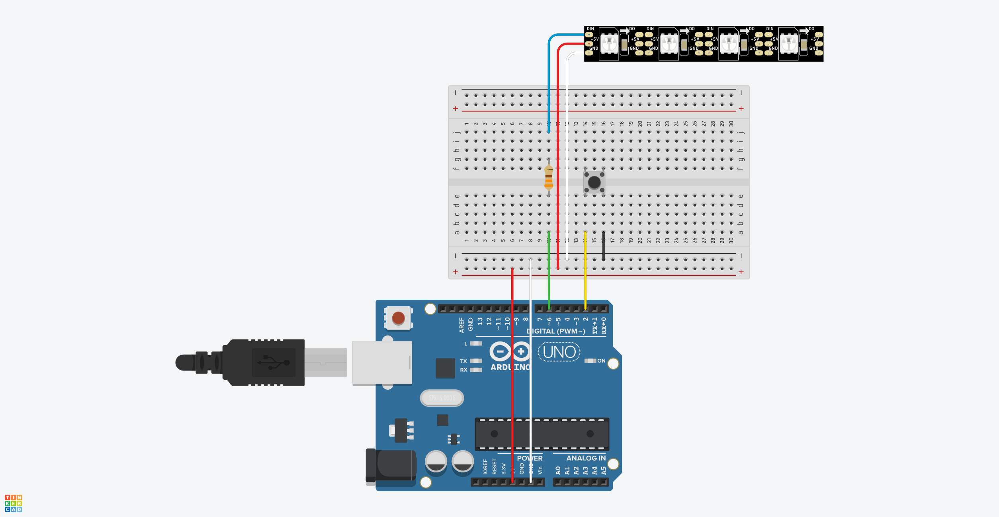

# Arduino RGB灯带系统


## 项目概述
An Arduino-based RGB lighting system, featuring 5 lighting modes.

## 🌟 Features

### 🎛️ 控制方式
- **按键控制**：
  - 短按：循环切换灯光模式
  - 长按(>1秒)：开关灯

## 硬件清单 / Parts List

- Arduino Uno R3 (or compatible)
- WS2812B LED strip, 60 LEDs, 5V
- Breadboard
- 330Ω resistor (for data line)
- Push button (12×12, 4-pin)
- Jumper wires (male-male)
- USB cable (for Arduino power/programming)
- Power supply (5V, if not powering from USB)

## 安装指南

### 1. 硬件组装

Below is the wiring diagram created in [Tinkercad Circuits](https://www.tinkercad.com/circuits). The NeoPixel Strip (4 LEDs) is used as a stand-in for the WS2812B LED strip. 



The wiring connections are as follows:
- Arduino 5V to Breadboard Positive Rail
- Arduino GND to Breadboard Negative Rail
- 330Ω resistor between Arduino D6 and the DIN of the LED strip
- LED strip VCC to Breadboard Positive Rail
- LED strip GND to Breadboard Negative Rail
- One diagonal pin of the push button to Arduino D2
- Other diagonal pin of the push button to Breadboard Negative Rail 

**Note:** The difference between the NeoPixel Strip and WS2812B LED strip is the pin order. The NeoPixel Strip has DIN, 5V, GND from top to bottom, while the WS2812B LED strip has 5V, DIN, GND from top to bottom. 

### 2. 软件 Setup

```bash
# Clone repository
git clone https://github.com/chenxing-dev/arduino-rgb-light.git

# Open in Arduino IDE
1. 安装库：FastLED
2. 选择开发板 (Arduino Uno)
3. 上传程序`rgb_desk_light.ino`
```

### 基本操作
1. **短按按键**：循环切换灯光模式
2. **长按按键(>1秒)**：开关灯

## 故障排除

| 问题       | 解决方案               |
| ---------- | ---------------------- |
| 按键无响应 | 确认开关对角脚接线正确 |

## 贡献指南
欢迎提交Pull Request！

## 许可证
[MIT License](LICENSE)
